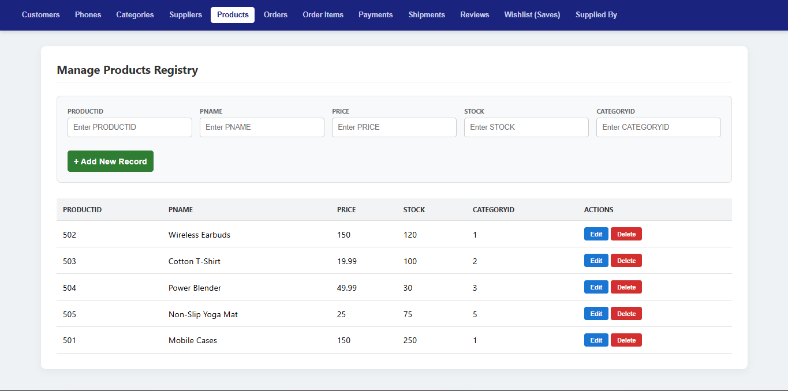

# E-Commerce Database Management System

A full-stack web application for managing database operations with an Oracle database backend. This application provides a user-friendly interface to interact with various database tables including customers, products, orders, and more.

## Features

* **Dynamic REST API:** A smart Node.js backend that automatically generates full CRUD (Create, Read, Update, Delete) endpoints for 12 different tables using a single mapping engine.
* **Unified React Dashboard:** A Single Page Application (SPA) that dynamically renders forms, tables, and columns based on the selected operational entity.
* **Strict Referential Integrity:** Autonomous enforcement of Foreign Keys and Cascading Deletes handled directly by the Oracle database engine, complete with smart UI error handling for protected records.
* **Secure Configuration:** Environment variables managed via `dotenv` to keep database credentials secure and out of version control.



## Tech Stack

* **Presentation Tier (Frontend):** React.js, Babel, HTML5, CSS3
* **Application Tier (Backend):** Node.js, Express.js, CORS support
* **Database Driver:** `oracledb` (Configured in Thick Mode for enterprise compatibility)
* **Data Tier (Database):** Oracle Database 

## 🗄️ Database Schema
The database is strictly normalized and consists of the following 12 tables:
`CUSTOMER`, `CUSTOMER_PHONE`, `CATEGORY`, `SUPPLIER`, `PRODUCT`, `ORDERS`, `ORDER_ITEM`, `PAYMENT`, `SHIPMENT`, `REVIEW`, `SAVES`, `SUPPLIED_BY`.

## Prerequisites

Before running this application, make sure you have the following installed:

1. **Node.js** installed on your machine.
2. **Oracle Database 11g Express Edition (XE)** installed and running locally (`OracleServiceXE` and `OracleXETNSListener` services must be active).

## Installation

### Step 1: Clone the Repository
```bash
git clone https://github.com/notslazer/e-commerce-database-system.git
cd your-repo-name
```

### Step 2: Install Dependencies
Install the required Node.js packages:
```bash
npm install express oracledb cors body-parser dotenv
```

### Step 3: Configure Environment Variables
Create a file named `.env` in the root directory of the project and add your Oracle database credentials:

```env
# Oracle Database Credentials
DB_USER=system
DB_PASSWORD=your_oracle_password_here
DB_CONNECTION_STRING=localhost:1521/XE

# Server Configuration
PORT=3000
```
*(Note: The `.env` file is ignored by Git for security purposes. See `.env.example` for reference).*

### Step 4: Initialize the Database

   - Ensure your Oracle database has the required tables created with appropriate Primary and Foreign Key constraints.
   - The application expects the following 12 tables: CUSTOMER, CUSTOMER_PHONE, CATEGORY, SUPPLIER, PRODUCT, ORDERS, ORDER_ITEM, PAYMENT, SHIPMENT, REVIEW, SAVES, SUPPLIED_BY

## Running the Application

1. **Start the server**:
   ```bash
   node server.js
   ```

2. **Open your browser** and navigate to `http://localhost:3000`

The application will start on the port specified in your `.env` file (default: 3000).

## API Endpoints

The application provides RESTful API endpoints for all the database tables:

- `GET /api/{table}` - Retrieve all records from a table
- `POST /api/{table}` - Create a new record
- `PUT /api/{table}/:id` - Update an existing record
- `DELETE /api/{table}/:id` - Delete a record

Available tables/endpoints:
- `/api/customers` - Customer management
- `/api/customer_phones` - Customer phone numbers
- `/api/categories` - Product categories
- `/api/suppliers` - Supplier information
- `/api/products` - Product catalog
- `/api/orders` - Order management
- `/api/order_items` - Order line items
- `/api/payments` - Payment records
- `/api/shipments` - Shipment tracking
- `/api/reviews` - Product reviews
- `/api/saves` - Saved products
- `/api/supplied_by` - Supplier-product relationships

## Project Structure

```
project-name/
├── index.html          # React frontend application
├── server.js           # Express server and API routes
├── package.json        # Node.js dependencies and scripts
├── .env.example        # Environment variables template
└── README.md
```

## Usage

1. **Navigation**: Use the navigation bar to switch between different database tables
2. **View Records**: Browse existing records in table format
3. **Add Records**: Click "Add New" to create new entries
4. **Edit Records**: Click the "Edit" button on any row to modify existing data
5. **Delete Records**: Click the "Delete" button to remove records


## License

This project was developed for academic and demonstration purposes only.

